# therAIpist

<p align="center">
  
</p>

A private, on-device iOS therapy companion — named personas, hands-free voice, knowledge graph, and 13 therapeutic modalities. No data leaves your phone.

Now with a **Narrative page** that writes your life story from your sessions, **Bring-Your-Own-Key** multi-provider support (OpenAI, Anthropic, DeepSeek, Groq, Together AI), a **Spiritual Advisor** persona drawing on wisdom traditions worldwide, and a redesigned **TabView** navigation.

---

## Screenshots

<table>
  <tr>
    <td align="center"><strong>Chats tab — all sessions</strong><br/>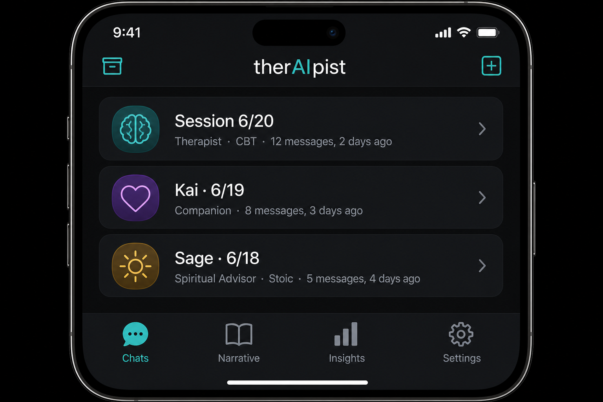</td>
    <td align="center"><strong>Chat — markdown rendering</strong><br/>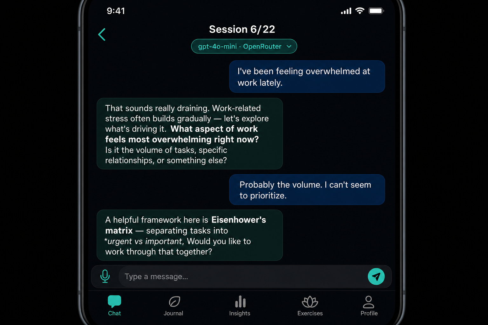</td>
    <td align="center"><strong>New Session — persona picker</strong><br/>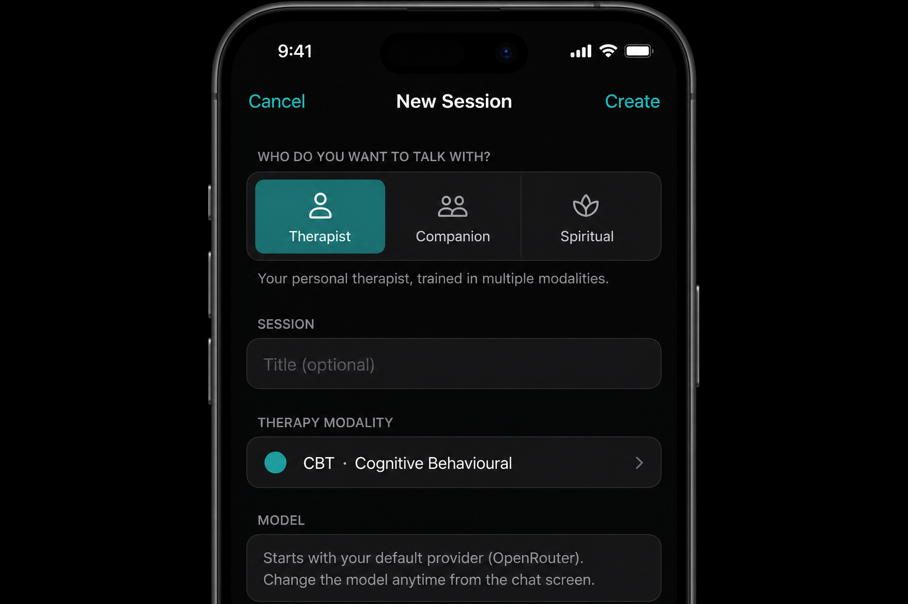</td>
  </tr>
  <tr>
    <td align="center"><strong>Narrative — life story</strong><br/>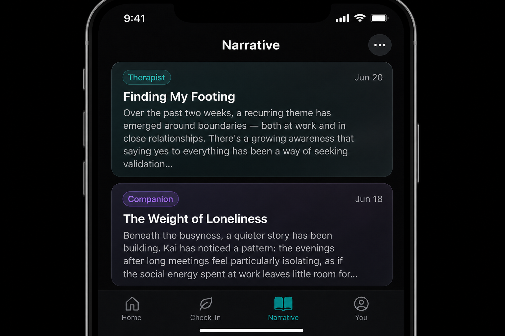</td>
    <td align="center"><strong>Model Picker — BYOK</strong><br/>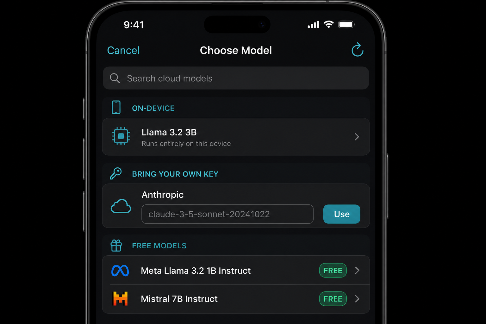</td>
    <td align="center"><strong>Settings — sub-screens</strong><br/>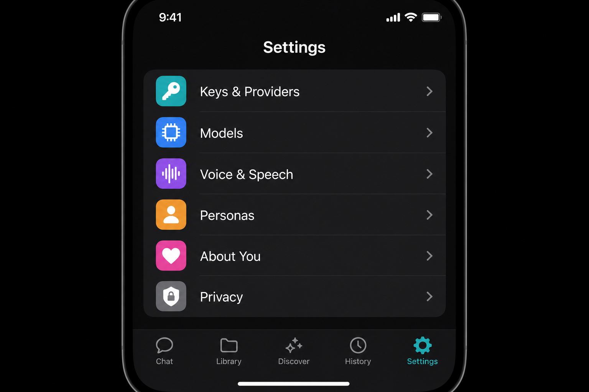</td>
  </tr>
  <tr>
    <td align="center"><strong>Therapist chat + insight badges</strong><br/>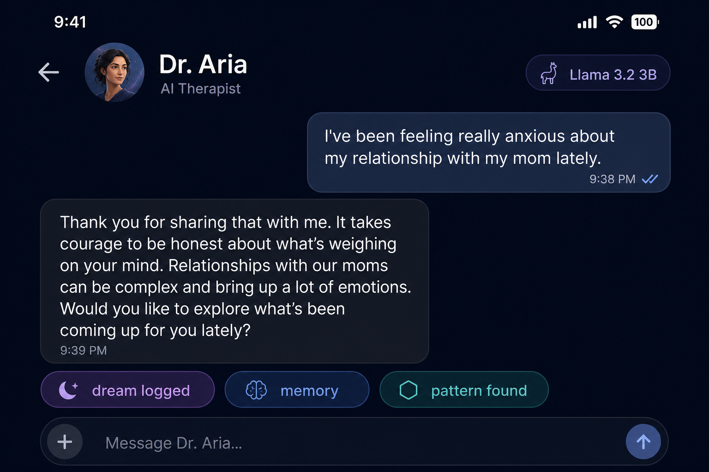</td>
    <td align="center"><strong>Companion Mode</strong><br/>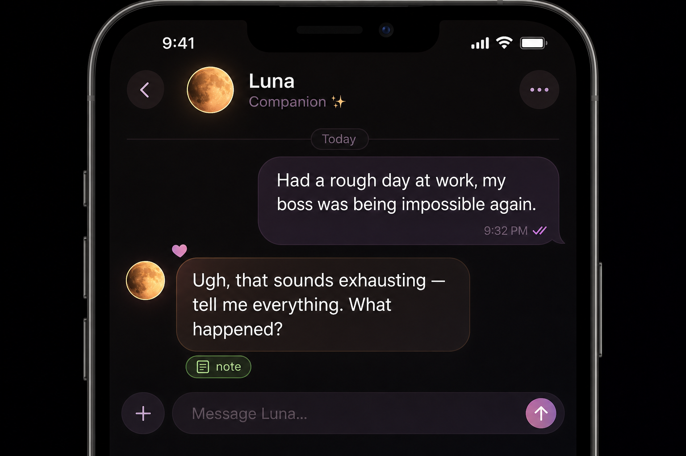</td>
    <td align="center"><strong>Hands-free voice mode</strong><br/>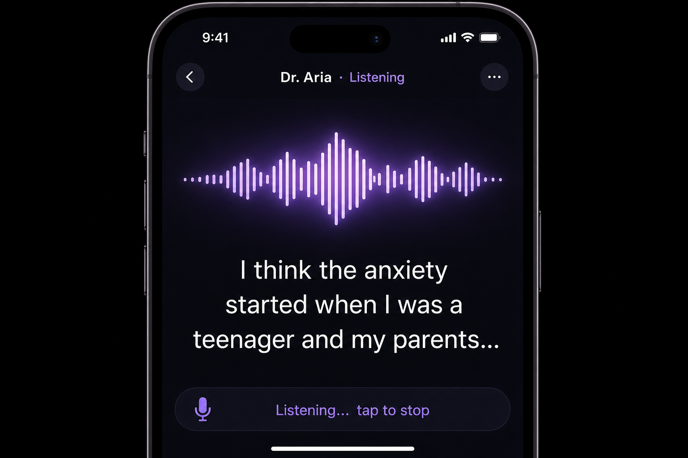</td>
  </tr>
  <tr>
    <td align="center"><strong>Dashboard — Your Patterns</strong><br/>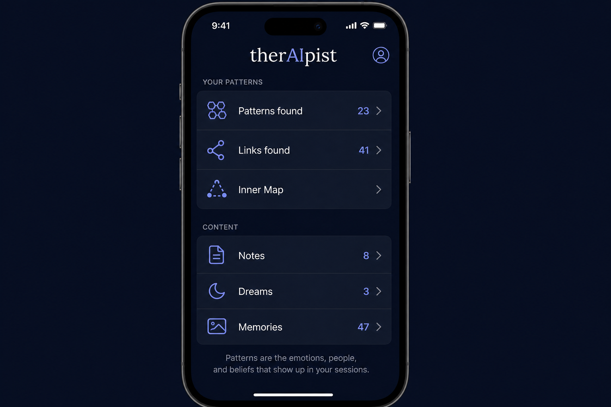</td>
    <td align="center"><strong>Inner Map (knowledge graph)</strong><br/>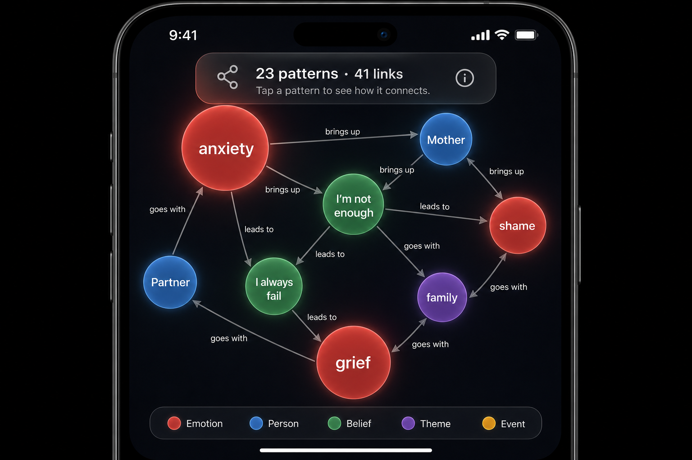</td>
    <td align="center"><strong>Pattern connections sheet</strong><br/>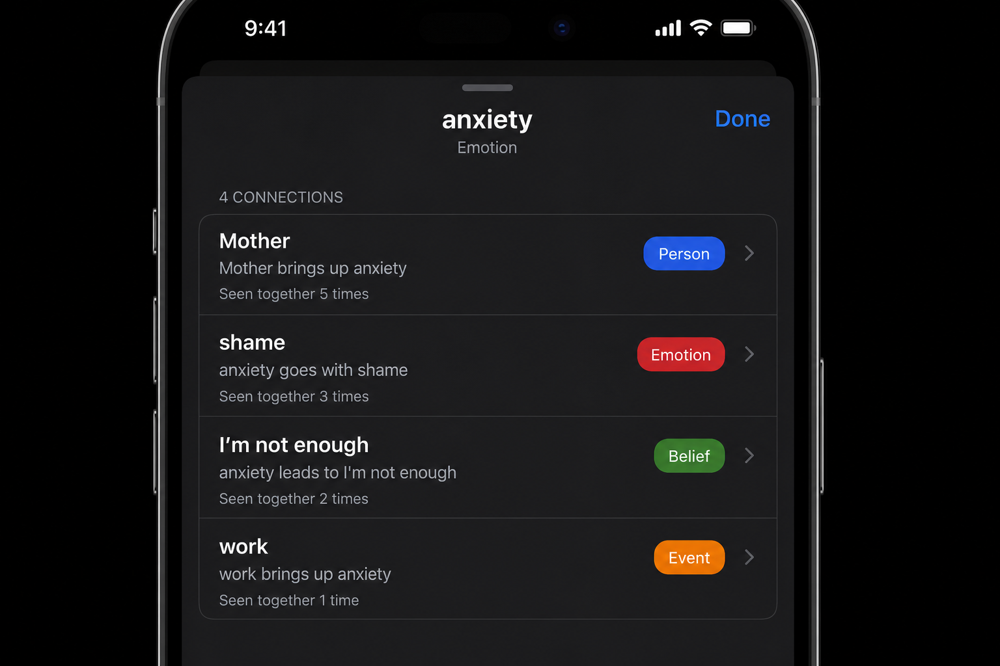</td>
  </tr>
  <tr>
    <td align="center"><strong>Session insights</strong><br/>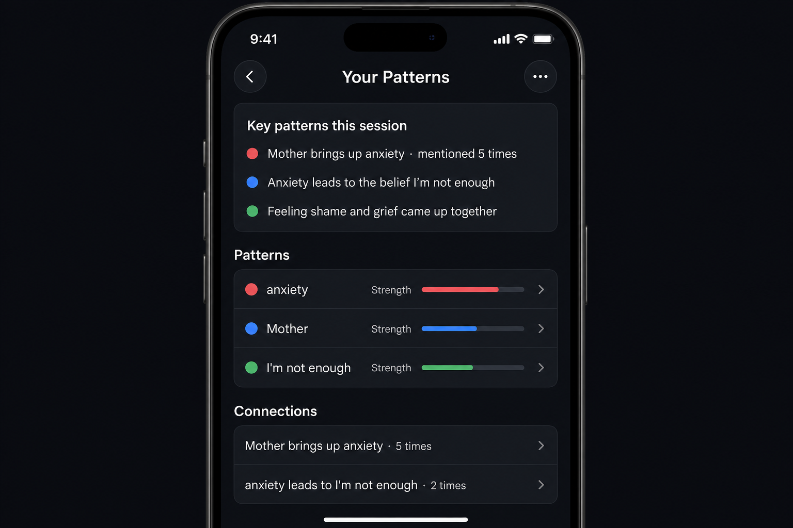</td>
    <td align="center"><strong>Persona settings</strong><br/>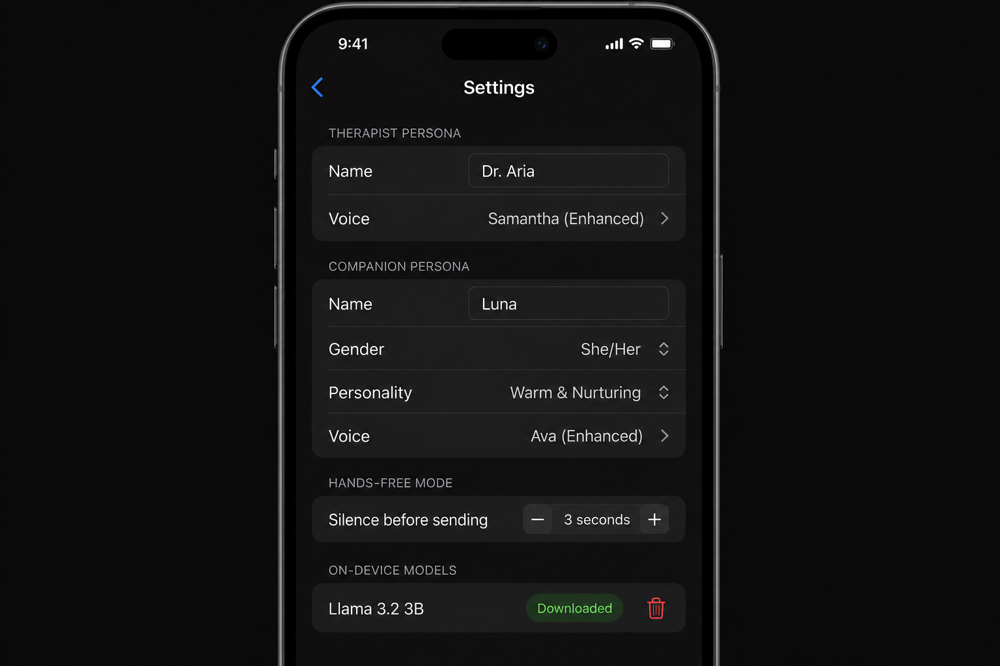</td>
    <td align="center"><strong>On-device model setup</strong><br/>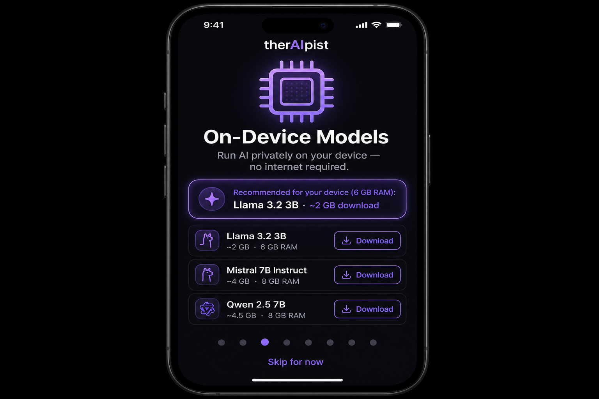</td>
  </tr>
</table>

---

> **Important disclaimer**
> therAIpist is **not** a licensed therapist, psychologist, or medical provider. It is a journaling and self-reflection tool only. It cannot diagnose, treat, or manage any mental health condition.
>
> **If you are in crisis, please reach out immediately:**
> - 🇺🇸 **988 Suicide & Crisis Lifeline** — call or text **988** — [988lifeline.org](https://988lifeline.org)
> - **Crisis Text Line** — text HOME to **741741** — [crisistextline.org](https://www.crisistextline.org)
> - **NAMI Helpline** — 1-800-950-6264 — [nami.org/help](https://www.nami.org/help)
> - **SAMHSA National Helpline** — 1-800-662-4357 — [samhsa.gov](https://www.samhsa.gov/find-help/national-helpline)
>
> Find a real therapist: [Psychology Today](https://www.psychologytoday.com/us/therapists) · [Open Path Collective](https://openpathcollective.org) · [BetterHelp](https://www.betterhelp.com)

---

## Features

### Personas
- **Therapist, Companion & Spiritual Advisor** — three distinct voices, all sharing the same memory and knowledge graph.
  - **Therapist** — follows one of 13 evidence-based therapeutic modalities.
  - **Companion** — a warm, chatty, non-sycophantic friend with configurable name, gender, and personality.
  - **Spiritual Advisor** — a wise, non-denominational guide drawing from Interfaith, Stoic, Buddhist, Christian, Jewish, Islamic, Hindu, Taoist, or Secular-Humanist traditions. Never proselytises or judges.
- **Named, voiced personalities** — each persona gets its own name and TTS voice in Settings → Personas.
- **Shared memory across personas** — all three read and write the same episodic/semantic memory, knowledge graph, and global memories.

### Narrative page
- An AI-written, chronological **life story** assembled from session notes, dream analyses, and global memories. Updates automatically on each launch/foreground when more than one hour has elapsed since the last generation, and refreshes manually on demand. Written from the perspective of whichever persona authored the most recent session.

### Bring Your Own Key (BYOK)
- Enter API keys for **OpenAI**, **Anthropic** (Claude), **DeepSeek**, **Groq**, **Together AI**, or **OpenRouter** in Settings → Keys & Providers. All keys are stored in the system **Keychain**, never in plaintext `UserDefaults`. The per-session model picker lets you choose any provider and model ID.

### Navigation & UI
- **Tab bar** — four top-level tabs: Chats · Narrative · Insights · Settings.
- **Settings sub-screens** — split into: Keys & Providers, Models, Voice & Speech, Personas, Profile & Intake, Privacy.
- **Markdown rendering** — assistant replies render bold, italic, code, and list formatting in chat bubbles.
- **Design tokens** — consistent colour system (`Theme.swift`) used across modality colours, node-type colours, and persona tints.

### Therapy & conversation
- **13 modalities** — Integrated, Adlerian, Jungian, DBT, CBT, Humanistic, Existential, Gestalt, Somatic, Narrative, ACT, Psychodynamic, and IFS — selectable per session (Therapist persona)
- **Adaptive verbosity** — the assistant calibrates response length based on conversational context
- **Text-to-speech** — responses spoken aloud with configurable voice, rate, and pitch; natural-sounding system voices
- **Hands-free voice mode** — a continuous speak/listen loop: the app transcribes your speech (on-device when supported), ends your turn automatically after a natural pause (~3s of silence), speaks the therapist's reply aloud, then returns to listening — no tapping between turns. The mic is torn down while speaking so it never transcribes its own voice. Long monologues are stitched across `SFSpeechRecognizer`'s ~1-minute segment limit, and tapping the speaker icon mid-reply skips it and resumes listening rather than stalling the loop.
- **Voice input** — also available via the keyboard's built-in dictation for typed messages

### Memory & knowledge
- **Episodic / semantic memory** — each exchange is embedded with Apple's `NLEmbedding` and recalled semantically in future turns within and across sessions
- **Global memories** — therapeutically significant moments (trauma mentions, major insights, grief, relationship patterns) are automatically promoted to a cross-session memory store with a three-tier importance system
- **Knowledge graph** — extracts emotions, persons, beliefs, and wires edges between co-occurring entities (person → TRIGGERS → emotion, emotion → CAUSES → belief, etc.)
- **In-message insight badges** — pill-shaped indicators appear beneath assistant replies to show when memories, graph nodes, edges, or global insights were captured in that exchange

### Models
- **Cloud (OpenRouter)** — access 300+ models; free models are surfaced first; list refreshed every 24 hours
- **On-device (local)** — GGUF models via `LLM.swift` / `llama.cpp` with Metal GPU acceleration; no API key, no internet, fully private
  - Llama 3.2 1B (~800 MB) — recommended for devices with 4–6 GB RAM
  - Llama 3.2 3B (~2 GB) — recommended for 6–8 GB RAM
  - Phi-3.5 Mini (~2.2 GB) — recommended for 8 GB+ RAM
- **Per-session model selection** — tap the model chip in the chat nav bar to switch

### Data & sessions
- **SwiftData persistence** — all data (messages, memories, nodes, edges, notes, dreams) is stored locally in a SwiftData store
- **Archive sessions** — swipe to archive instead of delete; all underlying data is preserved; restore at any time from the Archive tab
- **Auto dream capture** — when you describe a dream in chat (cues: "I had a dream", "I dreamt", "nightmare", etc.), the app automatically creates a `DreamModel` with extracted feelings and Jungian symbols; a `moon.zzz` badge appears on the assistant reply
- **Auto session summary note** — after the second user message in a session, a heuristic "Session Summary" reflection note is upserted (never duplicated), listing top emotions, people, themes, and beliefs from the current graph
- **Dashboard** — aggregated stats across all sessions; tap any stat (nodes, edges, memories, notes, dreams, global memories) to drill into the full list
- **Inner Map** — tap "Inner Map" on the Dashboard to open an offline Cytoscape.js visualisation of your entire cross-session knowledge graph; nodes are sized by strength and colour-coded by type; tap any node to open a native connections sheet listing every linked pattern with plain-language relationship sentences and co-occurrence counts

### Safety
- **Crisis detection** — every user message is checked with keyword matching that errs toward caution; crisis resources are surfaced automatically and persisted into the conversation
- **Boundary enforcement** — diagnostic or prescriptive assistant responses are intercepted and replaced before reaching the user
- **Safety event log** — all flagged exchanges are recorded per session
- **PIN lockout** — repeated incorrect PIN entries trigger an escalating lockout (30s → 60s → 5m → 15m) to deter brute-force unlocking
- **Clear configuration guidance** — if a session has no API key (cloud) or no downloaded model (on-device), the chat surfaces an actionable message instead of failing silently

### Onboarding
- **8-step setup** — welcome → disclaimer acknowledgment → OpenRouter API key → on-device model guide → personal intake → concerns → therapy background → goals
- **Device-aware model recommendation** — the on-device setup step reads actual device RAM and recommends the appropriate model
- **Full crisis resource list** during onboarding (before the user ever starts a session)

---

## Architecture

```
ios/Therapist/
├── Services/
│   ├── ChatService.swift          # Core turn orchestrator: memory, graph, LLM, safety,
│   │                              #   dream capture, note upsert
│   ├── InsightCaptureService.swift# Dream detection (heuristic) + session summary notes
│   ├── GraphExportService.swift   # Cross-session aggregation + GraphML + Cytoscape JSON
│   ├── LLMService.swift           # Routes to OpenRouter or local engine
│   ├── LocalLLMEngine.swift       # llama.cpp inference via LLM.swift; stop-sequence,
│   │                              #   timeout, concurrent-generation guards
│   ├── LocalModelService.swift    # Catalog, download management, progress tracking
│   ├── MemoryService.swift        # Episodic/semantic embedding + recall
│   ├── GlobalMemoryService.swift  # Cross-session significant memory promotion
│   ├── GraphService.swift         # Entity extraction + edge wiring
│   ├── DreamService.swift         # Dream recording (manual + auto from chat)
│   ├── NoteService.swift          # Note creation (manual + auto summary)
│   ├── TherapyService.swift       # Persona/modality prompts + system prompt assembly
│   ├── PersonaService.swift       # Therapist/Companion identity, name + voice resolution
│   ├── SpeechService.swift        # AVSpeechSynthesizer TTS wrapper (+ onFinish loop hook)
│   ├── VoiceConversationController.swift  # Hands-free loop: SFSpeechRecognizer +
│   │                              #   AVAudioEngine + silence endpointing
│   ├── BadgeBackfillService.swift # One-time retro-tagging of old conversations (v2:
│   │                              #   adds dream + note backfill)
│   ├── SafetyService.swift        # Crisis + boundary detection
│   └── AgentOrchestrator.swift    # Specialized sub-agents (routing by modality)
│
├── Models/
│   └── SwiftDataModels.swift      # SessionModel, MessageModel (capturedDream/Note),
│                                  #   MemoryModel, GraphNodeModel, GraphEdgeModel,
│                                  #   NoteModel, DreamModel, GlobalMemoryModel,
│                                  #   SafetyEventModel
│
├── Resources/
│   └── Graph/
│       ├── graph.html             # Cytoscape.js host page (offline, bundled)
│       └── cytoscape.min.js       # Pinned Cytoscape.js v3.30.4 (bundled, no CDN)
│
└── Views/
    ├── ContentView.swift          # Session list (archive-aware @Query)
    ├── ChatView.swift             # Chat UI + MessageBubble with insight badges
    │                              #   (moon.zzz dream, note.text note badges)
    ├── OnboardingView.swift       # 8-step first-launch flow
    ├── DashboardView.swift        # Stats + drill-down detail sheets + Graph Map
    ├── GraphVisualizationView.swift # WKWebView Cytoscape wrapper + export share sheet
    ├── SettingsView.swift         # API key, TTS, defaults, on-device model manager
    ├── ModelPickerView.swift      # Per-session cloud / on-device model picker
    ├── InsightsView.swift
    ├── NotesView.swift
    ├── DreamsView.swift
    └── GraphView.swift            # Per-session node/edge list view
```

---

## Getting Started

### Requirements

- Xcode 16+
- iOS 17+ device or simulator
- (Optional) [OpenRouter](https://openrouter.ai) API key for cloud models
- (Optional) 4–8 GB device RAM for on-device models

### Build

```bash
cd ios
xcodegen generate          # regenerates Therapist.xcodeproj from project.yml
open Therapist.xcodeproj
```

Build and run on your device or simulator. Swift Package Manager will resolve `LLM.swift` automatically on first build.

### First launch

The onboarding flow walks you through:

1. **Disclaimer** — read and acknowledge the app's limitations and crisis resources (required)
2. **OpenRouter API key** — skip this step if you only want on-device models
3. **On-device models** — device-personalised model recommendation; download from **Settings → On-Device Models** after setup
4. **Intake** — optional personal context (name, concerns, therapy history, goals) that shapes every session's system prompt

### On-device models

1. Open **Settings** (gear icon on the sessions screen)
2. Scroll to **On-Device Models**
3. Tap **Download** next to your chosen model (your device's RAM determines the recommendation)
4. Once downloaded, open any chat → tap the model chip → select **On-Device**

> **Note:** First inference after loading a model may take 10–30 seconds. Subsequent turns are faster. Keep the device plugged in during long sessions.

---

## Knowledge graph

Each user message is processed for entities:

| Entity type | Examples |
|-------------|---------|
| **Emotion** | anger, shame, grief, anxiety, loneliness |
| **Person** | Mother, Father, Partner, Ex-partner, Boss |
| **Belief** | "I always…", "I can't…", "I don't deserve…" |

Edges are wired between co-occurring entities in the same message:

| Edge | Meaning |
|------|---------|
| `Person → TRIGGERS → Emotion` | A relationship figure is mentioned alongside a feeling |
| `Emotion → CAUSES → Belief` | A feeling driving a cognitive pattern |
| `Belief → ASSOCIATED_WITH → Emotion` | Reciprocal link |
| `Emotion → ASSOCIATED_WITH → Emotion` | Co-occurring feelings |

View the graph any time via **Graph** in the chat toolbar.

### Inner Map (Dashboard)

The **Inner Map** on the Dashboard visualises your *entire* knowledge graph merged across all sessions:

- Nodes are sized by cumulative strength and coloured by type (blue = person, red = emotion, green = belief, orange = event, purple = theme)
- Edges carry plain-language relationship labels (e.g. "brings up", "leads to", "goes with")
- **Tap any node** to open a native connections sheet — a table of every linked pattern with the relationship sentence and how many times the two appeared together, sorted by strength
- Tap an edge for a tooltip showing the relationship in plain language; pinch to zoom, drag to pan

#### Export for analysis

Tap **Export** (↑ icon) to share the graph in two formats via the iOS share sheet (Mail, AirDrop, Files):

| Format | File | Use case |
|--------|------|----------|
| **GraphML** | `knowledge-graph.graphml` | Open in [Gephi](https://gephi.org) for advanced analysis, community detection, layout algorithms |
| **Cytoscape / Neo4j JSON** | `knowledge-graph.json` | Load into a Cytoscape.js web app or import nodes/edges into [Neo4j](https://neo4j.com) |

#### Gephi workflow

1. Export `knowledge-graph.graphml` from the app
2. In Gephi: **File → Open** → select the `.graphml` file
3. Use **Force Atlas 2** or **OpenOrd** for large graphs
4. The `strength` attribute (node) and `weight` attribute (edge) are imported as numeric properties for ranking and filtering

#### Future web explorer (Mac Mini)

The exported JSON uses the same `elements.nodes` / `elements.edges` Cytoscape.js shape, so a future Mac Mini web app can load the file directly with:
```js
cy.json(JSON.parse(graphmlContent).elements);
```

---

## Memory system

| Layer | Scope | How triggered |
|-------|-------|---------------|
| **Episodic memory** | Per-session | Every exchange; embedded with NLEmbedding |
| **Semantic memory** | Per-session | Consolidated from recent messages |
| **Global memory** | Cross-session | Tier-3: any trauma/crisis word; Tier-2: 2+ relationship/shame/grief words; Tier-1: 3+ distress words |

Global memories and cross-session episodic recall are injected into every new session's system prompt, giving the assistant continuity without requiring the user to repeat themselves.

---

## Session archive

Sessions are never hard-deleted by default:
- Swipe left → **Archive** (orange) — preserves all messages, memories, graph, notes, dreams
- Tap **Archive** in the toolbar → restore any session or permanently delete it

---

## Safety & ethics

- Crisis detection runs on every user message; it errs toward caution, so phrasing that contains a crisis keyword is flagged even when negated
- The app provides 988 and Crisis Text Line resources automatically when crisis signals are detected, and persists them into the conversation
- Boundary enforcement intercepts assistant responses containing diagnostic or prescriptive language
- All safety events are logged per session
- This project is for research and personal use only; it must not be presented as professional therapy

---

## Testing

A hosted XCTest target (`TherapistTests`) covers the core logic with positive and
negative cases, plus end-to-end pipeline tests:

- **Unit** — safety detection, knowledge-graph extraction/edges, memory keywording,
  global-memory promotion tiers, provider/model resolution, PIN brute-force lockout,
  voice transcript stitching, persona resolution / system-prompt selection,
  dream cue detection, symbol/feeling extraction, summary-note upsert idempotency,
  cross-session graph aggregation, GraphML/Cytoscape JSON shape + XML well-formedness
- **End-to-end** — `ChatService.processMessage` exercised with an in-memory SwiftData
  store and a mock LLM: normal turns (bubbles, memory, graph, badges), crisis routing,
  history ordering, boundary replacement, the no-API-key / no-model guidance paths,
  dream creation + dream badge, and note upsert idempotency
- **Concurrency** — `LocalLLMEngine` load serialization and graceful failure

Run them with:

```bash
cd ios
xcodegen generate
xcodebuild test -scheme Therapist -destination 'platform=iOS Simulator,name=iPhone 17'
```

---

## License

No license file is currently included; treat this repository as all-rights-reserved unless a license is added.
