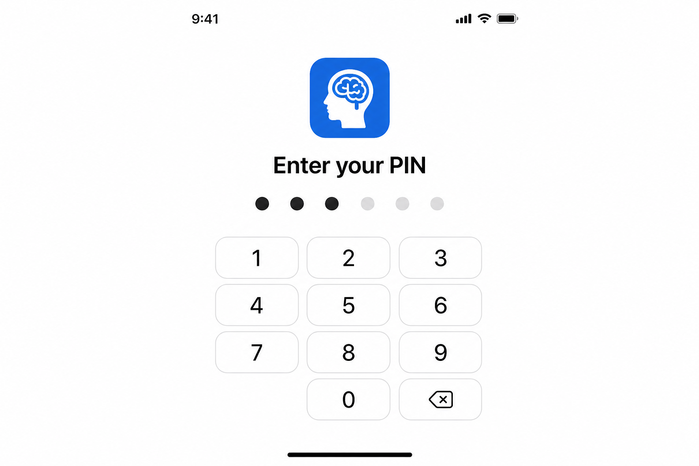
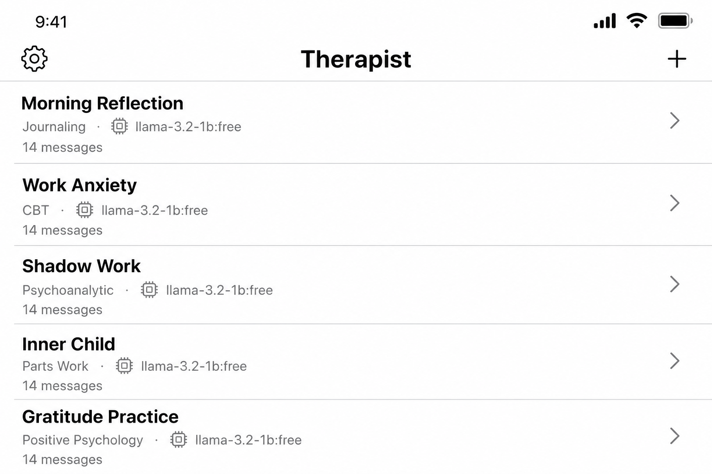
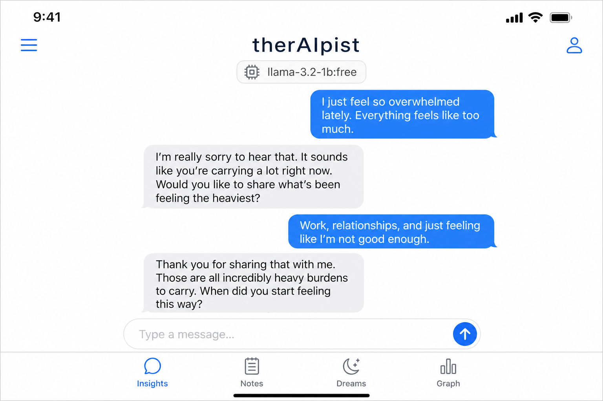
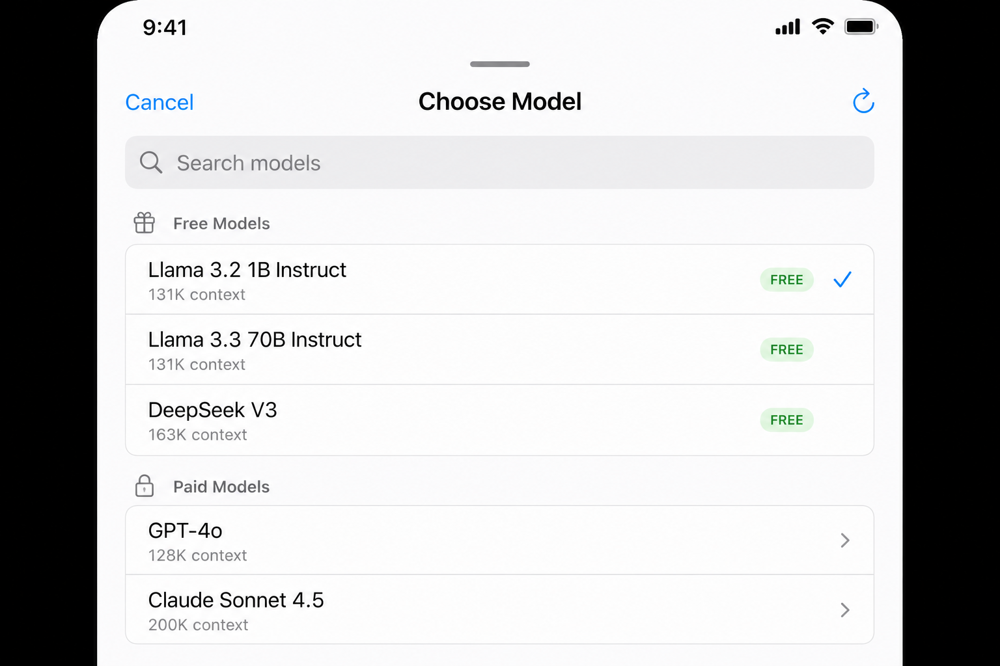

# therAIpist

An AI-assisted psychotherapeutic companion: a **FastAPI** backend paired with a native **SwiftUI** iPhone client. It blends multiple therapeutic traditions (Jungian, Adlerian, DBT, and an integrated mode), remembers context across conversations, and is built with safety boundaries and privacy in mind.

> **Disclaimer**
> therAIpist is an experimental support tool, **not** a licensed therapist and **not** a substitute for professional mental-health care. It does not diagnose conditions or prescribe treatment. If you are in crisis, contact your local emergency services or a crisis line (in the US: dial/text **988**).

---

## Screens

> The images below are **UI mockups/renderings** of the SwiftUI client (the app is built from source in Xcode; see [iOS app](#ios-app)).

| PIN login | Sessions |
|-----------|----------|
|  |  |

| Chat (in-chat model picker) | Model picker (free-first) |
|-----------------------------|---------------------------|
|  |  |

---

## Features

- **Multiple modalities** — Integrated, Adlerian, Jungian, and DBT therapy styles, selectable per session.
- **Conversational memory** — episodic/semantic/procedural memory with vector recall, so the assistant remembers relevant context across turns.
- **Knowledge graph** — extracts people, events, emotions, beliefs, and themes into a graph for richer insight.
- **Safety first** — negation-aware crisis detection with crisis-resource referrals, plus a redact-and-replace filter that blocks diagnostic or prescriptive assistant responses.
- **OpenRouter-first** — the iOS client and the intended backend configuration both use OpenRouter. The server provider abstraction also accepts Ollama sessions, but this is optional.
- **On-device privacy (iOS)** — conversations and their embeddings are stored locally with Apple's `NLEmbedding`; a Keychain-backed PIN gates the app.
- **Extras** — insights, notes, dream analysis, voice transcription, and a dashboard.

---

## Architecture

```
┌──────────────────────┐      REST API       ┌──────────────────────┐
│   iOS App (SwiftUI)  │ ◄─────────────────► │  FastAPI Backend      │
│   iPhone Client      │                      │  (Mac / server / VPS)│
└──────────────────────┘                      └───────┬──────────────┘
                                                       │
                      ┌────────────────────────────────┼─────────────────────────────┐
                      │                                │                             │
                ┌─────▼──────┐                ┌────────▼────────┐          ┌─────────▼─────────┐
                │  SQLite DB  │                │  Vector store    │          │  Provider Layer    │
                │ (server +   │                │ (in-memory or    │          │  Ollama │ OpenRouter│
                │  on-device) │                │  Qdrant)         │          │  + embedding prov. │
                └────────────┘                └─────────────────┘          └───────────────────┘
```

See [`ARCHITECTURE_PLAN.md`](ARCHITECTURE_PLAN.md) for the full design and phase roadmap.

### Repository layout

```
.
├── app/                  # FastAPI backend
│   ├── api/              # Routers (chat, sessions, memory, graph, safety, voice, …)
│   ├── agents/           # Crisis + specialized therapy agents and orchestrator
│   ├── core/             # config, database, security (API-key auth)
│   ├── models/           # SQLAlchemy ORM models + Pydantic schemas
│   └── services/         # chat, memory, safety, mode, graph, providers/
├── migrations/           # Alembic migrations
├── tests/                # pytest suite (200+ tests)
├── ios/Therapist/        # SwiftUI client (source tree)
├── desktop/              # Minimal Python desktop client
├── docker-compose.yml    # Qdrant for local vector storage
└── pyproject.toml
```

---

## Backend

### Requirements

- Python **3.12+**
- An [OpenRouter](https://openrouter.ai) API key
- (Optional) [Ollama](https://ollama.com) — only needed if you want local-model embeddings on the server (see note below)
- (Optional) Docker, to run Qdrant as the vector store

### Setup

```bash
python3 -m venv .venv
source .venv/bin/activate
pip install -e ".[dev]"
```

Create a `.env`:

```dotenv
DATABASE_URL=sqlite+aiosqlite:///./therapist.db

# OpenRouter — required for chat completions
OPENROUTER_API_KEY=sk-or-...
OPENROUTER_DEFAULT_MODEL=openai/gpt-4o

# Security — leave empty to disable auth for local dev
API_KEY=

# CORS — credentials are only honored when origins are explicit (not "*")
CORS_ORIGINS=["*"]
CORS_ALLOW_CREDENTIALS=false
```

> **A note on embeddings**
> The server's memory/recall system needs an embedding provider, and OpenRouter does not expose a reliable embeddings endpoint. By default it falls back to [Ollama](https://ollama.com) (`EMBEDDING_PROVIDER=ollama`). If you don't want to run Ollama, set `VECTOR_STORE_TYPE=in_memory` and the server will skip persistent vector recall (conversations are still stored in SQLite). A future update will support sentence-transformers as a fully local alternative.
>
> ```dotenv
> # Optional — only add if you want Ollama-backed memory recall
> EMBEDDING_PROVIDER=ollama
> EMBEDDING_MODEL=llama3.2
> OLLAMA_BASE_URL=http://localhost:11434
> ```

### Database migrations

The schema is managed with **Alembic**. For a fresh database:

```bash
alembic upgrade head
```

(`init_db` also creates tables on startup for local convenience, but Alembic is the source of truth for production.)

### Run

```bash
uvicorn app.main:app --reload
```

The API is then available at `http://localhost:8000` (interactive docs at `/docs`).

Optionally start the vector store:

```bash
docker compose up -d   # Qdrant on :6333
```

### Authentication

When `API_KEY` is set, every request must include it as either header:

```
Authorization: Bearer <API_KEY>
# or
X-API-Key: <API_KEY>
```

When `API_KEY` is empty, authentication is disabled (intended for local development only).

### API overview

| Method | Path | Description |
|--------|------|-------------|
| `GET` | `/health` | Health + provider model availability |
| `POST` / `GET` / `PATCH` / `DELETE` | `/sessions` | Manage therapy sessions |
| `POST` | `/chat` | Send a message, get a response |
| `GET` | `/chat/{session_id}` | Conversation history |
| `*` | `/memory`, `/graph`, `/insights`, `/therapy`, `/notes`, `/dreams`, `/voice`, `/safety`, `/mode`, `/agents`, `/dashboard` | Feature endpoints |

**`POST /chat`**

```json
{ "session_id": "uuid", "message": "I've been feeling anxious about work..." }
```

```json
{
  "response": "It sounds like work has been weighing on you...",
  "message_id": "uuid",
  "session_id": "uuid",
  "provider_used": "openrouter",
  "model_used": "openai/gpt-4o",
  "token_count": { "prompt": 245, "completion": 128 }
}
```

### Tests

```bash
pytest -q
```

---

## iOS app

A native SwiftUI client living in [`ios/Therapist/`](ios/Therapist). It is **OpenRouter-only** and designed for privacy.

- **Model selection from chat** — tap the model pill in the chat navigation bar to open the picker.
- **Free-first model list** — fetched from OpenRouter and cached for 24 hours; free models are surfaced first.
- **On-device memory** — each exchange is embedded with Apple's `NLEmbedding` and stored in SwiftData for local semantic recall.
- **PIN login** — a 6-digit PIN (stored in the Keychain) gates the app; change it from Settings.

### Building

The source tree under `ios/Therapist/` is added to an Xcode project (no `.xcodeproj` is committed). To run it:

1. Create a new iOS App in Xcode (SwiftUI lifecycle, SwiftData).
2. Add the files under `ios/Therapist/` to the target.
3. Add your OpenRouter API key in the app's **Settings** screen.
4. Build and run on iOS 17+.

---

## Safety & ethics

- **Crisis detection** runs on every user message with negation handling (e.g. "I don't want to die" is not flagged) and returns crisis resources (988, Crisis Text Line, 911) when warranted.
- **Boundary enforcement**: assistant responses containing diagnostic or prescriptive language are replaced before they reach the user, not merely logged.
- This project is for research/educational purposes and must not be presented as professional therapy.

---

## License

No license file is currently included; treat this repository as all-rights-reserved unless a license is added.
